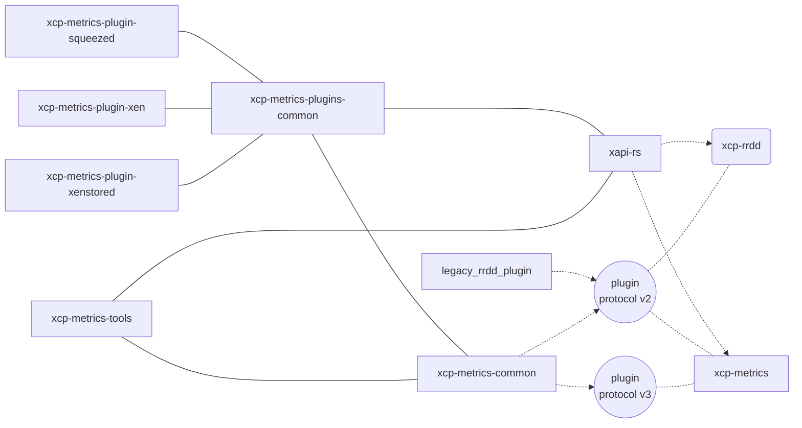

# xcp-metrics

xcp-metrics is a currently work in progress metrics daemon for xcp-ng.
It aims to support [OpenMetrics standard](https://github.com/OpenObservability/OpenMetrics) along with being (best-effort) compatible with original xcp-rrdd OCaml daemon.

## Project structure

## LICENSE

GNU Affero General Public License v3.0 only

https://spdx.org/licenses/AGPL-3.0-only.html